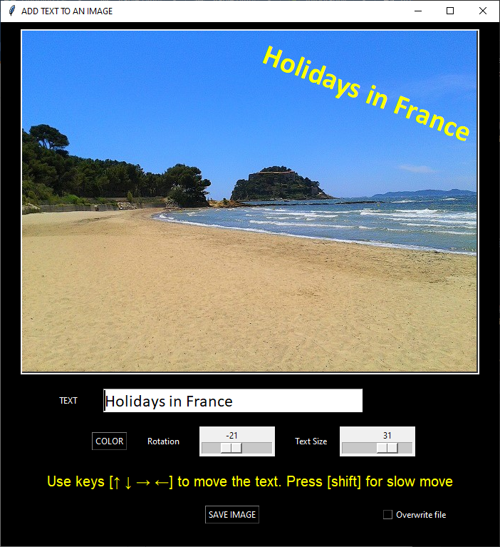

# IMAGE ANNOTATION TOOL ✍ 

To quickly annotate an image with a text that can be modified, resized, rotated, colorized.  
My wife use it to annotate pictures of her clothes for Vinted…  

## Requirements

- Python 3.8>=
- Pillow: to import larger image formats
- tkinterdnd2 : for drag and drop

## Install

>pip install

## Usage
	
Interface is self-explanatory  

- Drag and drop image on the drop zone  
- Modify the text, resize it, rotate it, change its color
- Move the text with the keyboard arrow keys (+shift to slow down)
- Save image (overwrite dropped image or create a new one)

Command line options

	>image_annotation_tool.py
	>image_annotation_tool.py "c:\users\joe\my_image.png"
        	                        └────▶  First argument is the path to the image to be opened
